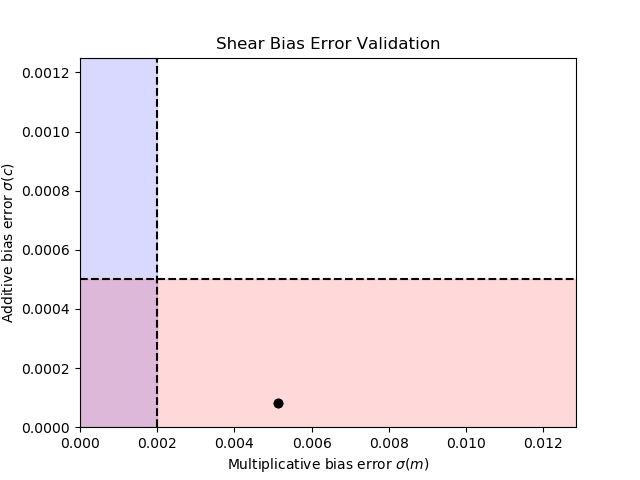

# SPR-T-SHE-000006-shear-bias-001

## Summary

**Validated Requirement(s):** R-SHE-CAL-F-070, R-SHE-CAL-F-080

**Relevent test or test case(s):** T-SHE-000006-shear-bias (TC-SHE-100017-shear-bias-m and TC-SHE-100018-shear-bias-c)

**Test dataset:** [TD-SHE-000006-global-validation](TD/TD-SHE-000006-global-validation.html)

**Test procedure:** Estimated shear values from LensMC were linearly regressed against true input shear values, and the slope and intercept of the regression were used to calculate the multiplicative and additive bias respectively. &sigma;

**Test result:** **POK** for both multiplicative and additive bias

We find the Requirement on the measurement error of the multiplicative bias, m, is marginally outside of requirements for the test data size, compared to the end-of-mission Requirement, but would meet requirements for a factor 6.25 larger area (a 372 sq.deg simulated survey) or for a survey with appropriate ellipticity noise cancellation, and within requirements for the c-bias error. However, we meet Requirements for DR1. This performance is due to the change in detection signal-to-noise dropping from 10 to 5 to mitigate selection bias. However, the absolute bias was unexpectedly larger than expected (although not a calibration Requirement) based on earlier tests. A number of known issues with SC8 may have caused this which are under investigation. As a result we designate this test POK, rather than OK.

## Requirement Interpretation

This test validates Requirements R-SHE-CAL-F-070 and R-SHE-CAL-F-080, which state:

* **R-SHE-CAL-F-070:** The average error on the multiplicative bias (&mu;) intrinsic to the ellipticity measurement per galaxy, accounting for the weak lensing weights, shall be less than 2x10-3 (1&sigma;) for the ensemble of galaxies used for weak lensing.
* **R-SHE-CAL-F-080:** The average error on the additive bias (c) intrinsic to the ellipticity measurement method, accounting for the weak lensing weights, shall be known to better than 5x10-4 (1&sigma;) for the ensemble of galaxies used for weak lensing.

That is, the requirements on the multiplative bias *m* and additive bias *c* when shear is estimated with an uncalibrated shear estimation algorithm are interpreted to be:

* *&sigma;*(*m*) < 2 x 10-3
* *&sigma;*(*c*) < 5 x 10-4

This test focuses on confirming that these conditions are met in a fiducial test case, where all parameters which impact shear bias are accurately known, i.e. the simulations used to estimate shear bias accurately reflect reality. Test T-SHE-000012-calibr-simul tests that expected errors in these parameters will not cause errors on bias to exceed these requirements.

## Detailed test results

When the bias was measured with the shear estimation method LensMC, it was found to have bias and errors on such of:

* *m*1 = -0.19604 +/- 0.00514
* *m*2 = -0.18275 +/- 0.00512
* *c*1 = (-8.13002 +/- 0.08181) x 10-3
* *c*2 = (-0.42275 +/- 0.08161) x 10-3

The measured error on the bias parameters is 

* &sigma;(m) = 5.1 x 10-3,
* &sigma;(c) = 8.2 x 10-5,

modulo negligible differences between the two polar components. We see that for the 59.5 sq. deg. of SC8 data we are marginally outside of the Requirements for the error on m (factor of ~2.5), and well within Requirements for the error on c. This study was limited by the available sky area processed during the Science Challenge, and would imply that an area of 6.25 larger (372 sq. degs) would meet the m-bias error Requirement.  However, we note that the SC8 results would be within Requirements for DR1, if we were to assume a factor of root-6 or better increase in errors. 

The fact that the precision of the shear bias we observe here is better than expected for this area is most likely due to the relaxation of the S/N limit for galaxy detection from 10 to 5, to reduce the impact of selection bias, which boosts the number of detected galaxies in the WL sample. This implies there is some optimization to be done in the selection of Weak Lensing galaxies.

We also note that for all components the absolute value of the bias parameters differs from zero at very high significance (at least 5σ in all cases). Although the Requirements do not directly test this, the LensMC algorithm was expected to have near-zero bias from independent tests on simulated data. There are a number of possible reasons for this deviation. The PSF model used for the SC8 simulations is known to have been an older version than the one applied in the shear measurement, hence there may have been some transfer of PSF ellipticity and size to the shear measurement due to this inconsistency. In addition, it is known that some of the fields had incorrect astrometric solutions, which led to inconsistent galaxy positions in some images. These issues are under investigation, as well as investigation into potential yet-unknown issues.
